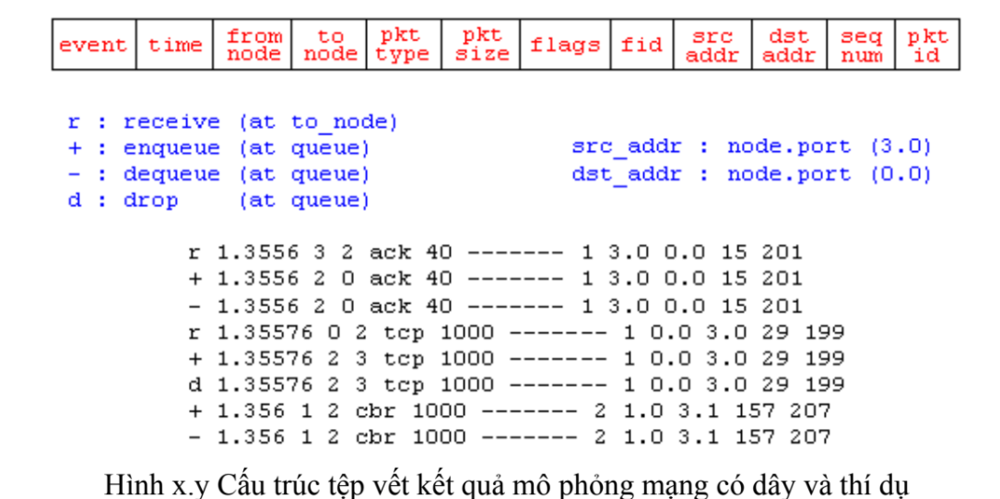

# Bộ mô phỏng NS2

## Giới thiệu
- là phẩn mềm mô phỏng mạng viết = C++ và Otcl
- khả năng tương tác với mạng thực: cho phép lưu lượng thực đi qua nút mạng tương tác với bộ mô phỏng chạy trên nút mạng đó
- khả năng hiển thị trực quan: NAM giúp thấy đc hình ảnh hđ của mạng = trực giác
- Phân tích file lưu vết quá trình mô phỏng: Perl, Awk
- Vẽ đồ thị: XGRAPH, GNUPLOT

## Chức năng chính
### Mạng có dây
- đường truyền điểm - điểm đơn công, song công, LAN
- chính sách phục vụ hàng đợi
- mô hình sinh lỗi
- định tuyến unicast/multicast
- giao thức giao vận: tcp, udp, điều khiền lưu lượng và điều khiển tắc nghẽn
- giao thức tầng ứng dụng, web caching, truyền luồng dữ liệu đa phương tiện

### Mạng k dây
- kênh truyền
- sự di chuyển của các nút mạng trong k gian 2 chiều
- LAN k dây (802.11)
- Mobile IP
- Adhoc networks: DSDV, DSR, AODV, TORA

## Các bước tiến hành mô phỏng
### Tạo bộ lập lịch cả sự kiện
- set ns [new Simulator]
- $ns at <time><event>
- vd: $ns at 0.4 "$ftp0 start" (thời điểm 0.4 bắt đầu tuôn lưu lượng)
- $ns run (thực thi bộ ns)

### Ghi lại vết các sự kiện của mạng mô phỏng để phân tích = perl

#Open the NAM trace file --------------------------------------
set nf [open chapter5_sample1.nam w]
$ns namtrace-all $nf
#Open the Trace file -----------------------------------------
set tf [open chapter5_sample1.tr w]
$ns trace-all $tf

### Thiết lập mạng mô phỏng
Thiết lập topo:

//tạo nodes
set s0 [$ns node]
set s1 [$ns node]

// liên kết các node (duplex: đường truyền song công, 2 chiều đồng thời), thiết lập băng thông (Mbps), độ trễ, kiểu hàng đợi
$ns duplex-link $s0 $s1 10Mb 5ms DropTail
Chọn thuật toán định tuyến

### tạo kết nối ở tầng giao vận

// TCP
- tạo các thực thể gửi và nhận của tcp (tsrc: source TCP agent; tdst: destination TCP agent)
set tsrc [new Agent/TCP] //khai báo agent tcp để vận chuyển lưu lượng //node nguồn
set tdst [new Agent/TCPSink] //nút đích

- gắn các thực thể tcp với node mạng
$ns attach-agent $n0 $tsrc
$ns attach-agent $n1 $tsrt

- tạo ra kết nối giữa thực thể gửi và nhận TCP
$ns connect $tsrc $tdst

// UDP
set usrc [new Agent/UDP]
set udst [new Agent/NULL]
$ns attach-agent $n0 $usrc
$ns attach-agent $n1 $usrt
$ns connect $usrc $udst

### tạo nguồn sinh lưu lượng
// tcp vận chuyển lưu lượng ftp
// udp - cbr

// Lưu lượng của ứng dụng FTP
set ftp [new Application/FTP] //biến ftp
$ftp attach-agent $tsrc //gắn ftp với agent nguồn
`$ns at <time> "$ftp start"` // chỉ ra thời điểm tuôn lưu lượng ftp

// kiểu hàng đợi drop tail
- phục vụ theo nguyên tắc FIFO
- hàng đợi đầy những gói tin đến sau bị drop

// queue-limit
$ns queue-limit $n2 $n3 10
- k có mặc định là 50 gói tin

// vị trí
$ns duplex-link-op $n0 $n2 orient up // n2 trên n0

// 90 độ, tức là khi gói tin bị drop sẽ tạo đường vuông góc với anh nằm ngang
$ns duplex-link-op $n2 $n3 queuePos 0.5

// flow id của luồng dữ liệu
$tcp0 set fid_ 1

// kích thước của gói tin tcp (mặc định là 1040byte)
$tcp0 set packetSize_ 1009

// thời gian tuôn lưu lượng
`$ns at 0.5 "$ftp0 start"`

## Tìm hiểu tệp vết để xác định thông số hiệu năng cho hệ thống mạng
// Quá trình mô phỏng mạng lưu trong tệp viết
// Phân tích tệp vết vidu2.tr = perl

// nắm đc ý nghĩa các trg trong tệp vết

- Cho mạng có dây


1. event: ký hiệu sự kiện, có thể là 1 trong 4 chữ cái sau:
− r (receive): có gói tin được nhận tại node “to node”.
− + (enqueue): có gói tin được xếp vào hàng đợi tại node “from node” để chờ gửi
đến node “to node”.
− - (dequeue): có gói tin được gửi (send) từ node “from node” đến node “to node”.
− d (drop): có gói tin gửi từ node “from node” đến node “to node” bị loại (có thể hiểu là trên đường truyền và không đến được node “to node”).
2. time: thời điểm xảy ra sự kiện (chú ý: time là giá trị thực, có tối đa 5 chữ số sau dấu chấm thập phân).
3. from node: số của node mạng gửi gói tin
4. to node: số của node mạng nhận gói tin. Hai trường from node và to node xác định đường truyền trên đó xảy ra sự kiện. (Chú ý: số của node mạng do NS-2 sinh ra theo thứ tự tạo ra node – “create node_”, bắt đầu từ số 0).
5. pkt type: cho biết loại của gói tin.
6. pkt size: kích thước của gói tin, đơn vị là byte.
7. flags: trường cờ, gồm 6 cờ, mỗi cờ tương ứng với 1 bit trong header của gói tin. Giá trị 0 của mỗi cờ được thể hiện bằng ký tự ‘-‘. Hiện tại, đối với mạng có dây, NS-2 mới chỉ sử dụng 4 cờ sau để thông báo ECN (Explicit Congestion Notification):
− “E” để báo có tắc nghẽn (CE - Congestion Experienced),;
− “N” để thông báo tầng giao vận có khả năng xử lý báo hiệu ECT (ECN-Capable-Transport) trong IP header.
− “C” (ECN-Echo): gói tin chứa thông báo tắc nghẽn, do bên nhận gửi cho bên gửi sau khi nó nhận được gói tin có cờ “E”.
− “A” for Congestion Window Reduced (CWR) in the TCP header.
Còn 2 cờ khác nữa là: “P” - cờ ưu tiên và “F” – báo hiệu TCP Fast Start.
8. fid (flow id): Chứa giá trị fid của IPv6, người lập trình có thể thiết lập giá trị fid cho các gói tin thuộc mỗt kết nối khi viết chương trình mô phỏng bằng OTcl script để phục vụ cho việc phân tích tệp vết của mình và để chương trình NAM có thể hiển thị màu của các gói tin căn cứ theo giá trị của fid.
9. src addr (source address): địa chỉ nguồn gửi gói tin, có dạng “node.port".
10. dst addr (destination address): tương tự src addr.
11.seq number (sequence number): số thứ tự của gói tin của giao thức tầng mạng (và tầng giao vận). Chú ý rằng NS-2 vẫn đánh STT gói tin UDP trong tệp vết để hỗ trợ việc phân tích kết quả mô phỏng, mặc dầu giao thức UDP trong thực tế không đánh số thứ tự gói tin.
12. pkt id (packet id: chứa số định danh của gói tin. Cần chú ý rằng, các gói tin bị loại(droped) sẽ được một số giao thức (như TCP) phát lại với cùng giá trị seq number, nhưng NS-2 gán giá trị pkt id khác để hỗ trợ việc phân tích được thuận lợi.

// ack là gói tin báo nhận (Acknowledgement)
Ví dụ: sự kiện nhận (r) diễn ra ở thời điểm 1.3556s từ node 3 đến node 2 loại gói tin: ack kích thước: 40 byte trường flag fid: 1 nút nguồn: 3 nút đích: 0 port nguồn và đích đều là 0
+ : đẩy gói tin vào hàng đợi
fid: id của luồng dữ liệu
seq num: thứ tự gói tin


### Tính thông lượng trung bình
- được xác định = tổng kích thước các gói tin nhận đc/(thời điểm nhận đc gói tin cuối cùng - thời điểm nhận đc gói tin đầu) (byte/s)
1. $sum là tổng lưu lượng (số byte) nhận được tại node $tpnode
2. $end_time - $start_time (sec) là thời gian truyền lưu lượng qua kết nối.
Như vậy `$sum / ($end_time - $start_time)` chính là thông lượng cần tính (bytes/s)

Giá trị thông lượng trung bình của 4 kết nối tính được cụ thể như sau:
− cbr: 1109.0625(Kbps)
− ftp0: 742.65625(Kbps)
− ftp3: 281.96875(Kbps)
− ftp2: 277.09375(Kbps)
Nhận xét:

- Luồng cbr có thông lượng cao xấp xỉ bằng tốc độ sinh lưu lượng ( đưa vào mạng) được chúng ta thiết lập bằng 1.5Mbps.
- Các luồng lưu lượng ftp0, ftp1 và ftp2 mặc dù đều truyền dữ liệu trong khoảng thời gian bằng nhau và bằng 10s, nhưng đạt được thông lượng trung bình khác nhau do được thiết lập các giá trị cửa sổ cực đại khác nhau (32, 16 và 64 packet).

`perl avg_throughput_during_sim_time.pl <trace file> <flow id> <required node>`
Trong đó, các tham số dòng lệnh:
− `<trace file>` file đầu vào dùng để phân tích (thí dụ: chapter5_sample1.tr)
− `<flow id>` id của kết nối cần tính thông lượng trung bình
(thí dụ với các luồng tcp0:1, tcp1:2, tcp2:3, tcp3:4)
− `<required node>` nốt nhận lưu lượng cần tính thông lượng trung bình.

(thí dụ: node 3 và 4 có thể nhận các lưu lượng ftp0, ftp1, ftp2,
cbr; node 5 chỉ nhận lưu lượng ftp0, node 6 có thể nhận lưu
lượng ftp1 và cbr, node 7 chỉ nhận lưu lượng ftp2).
// udp/null: là cặp thực thể gửi/nhận của giao thức udp;
// tcp0/sink0, tcp1/sink1, tcp2/sink2: là các cặp thực thể gửi/nhận của giao thức tcp;
// ftp0, ... là các nguồn sinh lưu lượng của các ứng dụng truyền file – FTP;
// cbr: là nguồn sinh lưu lượng với tốc độ không đổi (Constant Bit Rate);

// set tcp0 [$ns create-connection TCP/Reno $s0 TCPSink $s5 0] ;# fid_ = 0
thiết lập flow id (fid_) bằng 0 cho luồng lưu lượng tcp từ node s0 đến node s5.

$cbr set random_ false
Tham số (cờ ) random_ dùng để báo cho NS-2 lập lịch gửi các gói tin cbr ở các thời điểm ngẫu nhiên. Trong thí dụ này chúng ta thiết lập cho random_ bằng false, nghĩa là các gói tin sẽ được gửi đi đều đặn, cách nhau những khoảng thời gian xác định, phụ thuộc vào kích thước gói tin và rate_.

`$cbr set packet_size_ 1000 ; Default value = 1000 bytes`
$cbr set rate_ 1.5mb
windows_ : cửa sổ gửi cực đại; Mbps = Mega bits per second; ms = mili second
// window size: là các bit dùng để điều khiển cờ (flag) ACK, cờ Sequence (bytes)
// 3tcp: s0 s5, s1 s6, s2 s7
// 1 udp: s1 s6

// Tính thông lượng của từng kết nối
perl avg_throughput_during_sim_time.pl chapter5_sample1.tr 0 5
perl avg_throughput_during_sim_time.pl chapter5_sample1.tr 1 6
perl avg_throughput_during_sim_time.pl chapter5_sample1.tr 2 7
perl avg_throughput_during_sim_time.pl chapter5_sample1.tr 3 6

### Tính độ trễ trung bình của từng kết nối
Độ trễ trung bình được tính bằng tổng độ trễ của từng gói tin gửi thành công chia cho tổng số lượng gói tin nhận được.

//`perl avg_delay_during_sim_time.pl <trace file> <flow id> <source node> <dest node>`
perl avg_delay_during_sim_time.pl chapter5_sample1.tr 0 0 5
perl avg_delay_during_sim_time.pl chapter5_sample1.tr 1 1 6
perl avg_delay_during_sim_time.pl chapter5_sample1.tr 2 2 7
perl avg_delay_during_sim_time.pl chapter5_sample1.tr 3 1 6

Nhận xét:

- Độ trễ trung bình của các gói tin thuộc luồng cbr có giá trị nhỏ nhất, bởi vì khi gửi đi các gói tin, thực thể gửi UDP không cần chờ phản hồi, không cần tự thích ứng với dải thông của đường truyền.
- Các luồng lưu lượng ftp0, ftp1 và ftp2 mặc dù đều truyền dữ liệu trong khoảng thời gian bằng nhau, qua cùng một số node mạng và qua các đường truyền có dải thông và độ trễ như nhau; tuy nhiên độ trễ trung bình của các gói tin của các luồng khác nhau, do giá trị cực đại của các cửa sổ gửi được thiết lập khác nhau (32, 16 và 64 packet).

### Phân tích file
// biến nhận đầu vào
```
$infile=$ARGV[0];
$flow=$ARGV[1];
$src=$ARGV[2];
$dst=$ARGV[3];
```

// Mảng lưu id và thời điểm gửi gói tin
// Mảng lưu id và thời điểm nhận gói tin
// khởi tạo các p tử đều là 0

```
@send = (0..0);
@recv = (0..0);
```

// lưu tại id lớn nhất của gói tin để duyệt từ 0 đến max
`$max_pktid = 0;`

// tính độ trễ từng gói + lại / tổng số gói

```
$node_ = $x[2] if (($event_ eq "+") || ($event_ eq "s"));
$node_ = $x[3] if ($event_ eq "r");
```
// ghi thời điểm gửi và nhận từng gói tin vào mảng, $num đếm số gói tin
```
if ((($event_ eq "+") || ($event_ eq "s")) && ($flow_ == $flow) && ($node_ == $src) && (!$send[$pkt_])) {
# Kiem tra (!$send[$pkt_]) dam bao luon tinh goi tin duoc gui lan dau,k tinh goi tin gui lai
$send[$pkt_] = $time_;
$max_pktid = $pkt_ if ($max_pktid < $pkt_);
}
if (($event_ eq "r") && ($flow_ == $flow) && ($node_ == $dst)) {
$recv[$pkt_] = $time_;
$num++;
}
}
```

